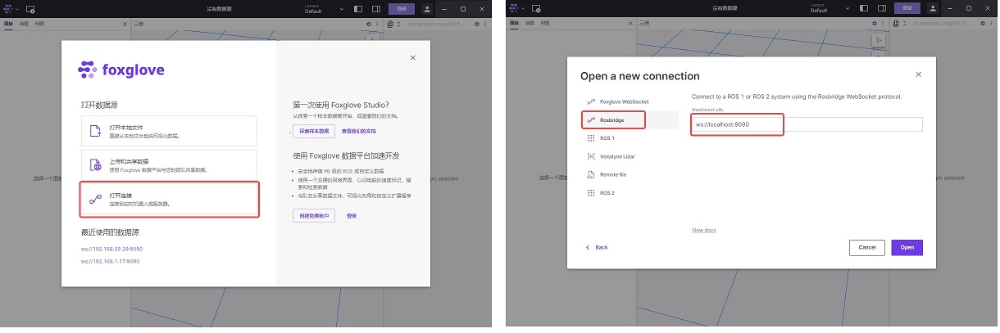
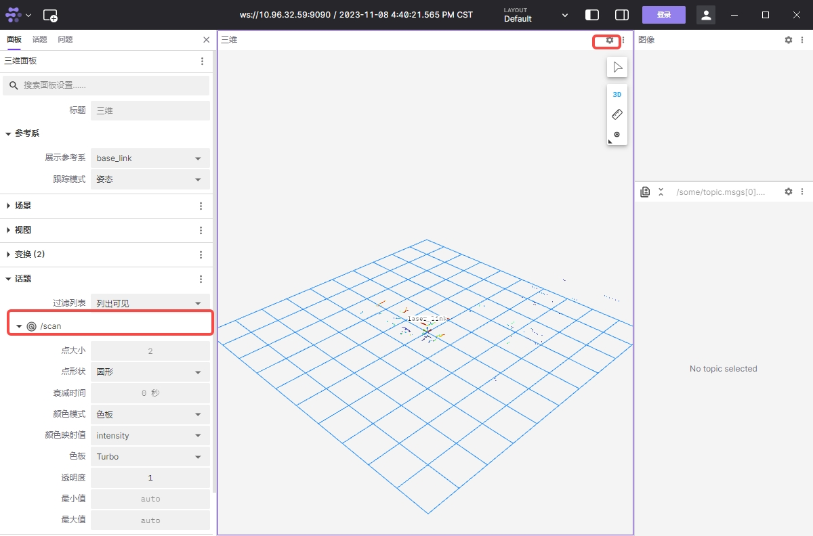
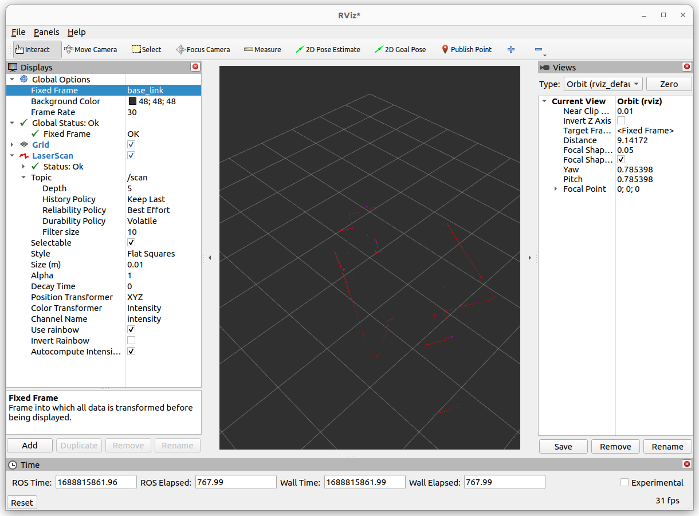

# 功能介绍

LSLIDAR ROS2驱动，以ROS2标准消息格式发送激光雷达数据。

# 物品清单

完善的产品型号请以[lslidar官网](https://www.leishen-lidar.com/tof) LSLIDAR X3为例进行演示。


| 物料选项    | 清单      | 
| ------- | ------------ | 
| RDK X3  | [购买链接](https://developer.horizon.ai/sunrise) | 
| LSLIDAR X3 | [购买链接](https://www.leishen-lidar.com/tof/73) | 

# 使用方法

## 准备工作

1. 地平线RDK已烧录好地平线提供的Ubuntu 20.04系统镜像。

2. LSLIDAR正确链接RDK X3

## 安装LSLIDAR驱动

通过终端或者VNC连接RDK X3，执行以下命令

```bash
sudo apt update
sudo apt install -y tros-lslidar-driver
```
**注意：如果安装s时LSLIDAR已连接在RDK X3上，则安装完后需要重新拔插一次**

## 运行LSLIDAR

```bash
source /opt/tros/setup.bash
ros2 launch lslidar_driver lslidar_launch.py
```

## 查看雷达数据

### 方式1 命令行方式

新打开一个终端，在里面输入以下命令查看激光雷达输出数据

```bash
source /opt/tros/setup.bash
ros2 topic echo /scan
```
### 方式2 使用foxglove可视化

***注意：运行Foxglove Studio的设备应与RDK设备处于同一网段***

1. 前往foxglove[官网下载](https://foxglove.dev/download)Foxglove Studio,并在PC上进行安装

2. 新打开一个RDK终端并输入以下命令安装rosbridge

```bash
sudo apt install ros-foxy-rosbridge-suite
```

3. 运行以下命令启动rosbridge

```bash
source /opt/tros/setup.bash
ros2 launch rosbridge_server rosbridge_websocket_launch.xml
```
4. 打开Foxglove Studio，选择“打开连接”，在接下来的对话框中选择rosbridge连接方式，并填入RDK的ip地址取代localhost



5. 在foxglove studio中点击右上角的“设置”按钮，在左侧弹出的面板中将雷达话题配置“可见”，此时studio中讲实时显示雷达点图



### 方式3 RVIZ方式

在PC或者支持RVIZ的环境下安装ROS2，这里以foxy版本为例，运行

```bash
source /opt/ros/foxy/setup.bash
ros2 run rviz2 rviz2
```

添加LaserScan，配置Reliability Policy为System Default


设置Fixed Frame为base_link或者laser_link即可看到激光雷达采集数据




# 接口说明

## 话题

### 发布话题
| Topic                | Type                    | Description                                      |
|----------------------|-------------------------|--------------------------------------------------|
| `scan`               | sensor_msgs/LaserScan   | 二维激光雷达扫描数据                |


## 参数
| Parameter name | Data Type | detail                                                       |
| -------------- | ------- | ------------------------------------------------------------ |
| frame_id     | string | frame名称默认值: `laser_frame` |
| group_ip     | string | 激光雷达的组播网口`224.1.1.2`|
| add_multicast  | bool | 是否增加组播IP. <br/>默认值: `false` |
| device_ip     | string | 激光雷达源IP`192.168.1.200`|
| device_ip_difop   | string | 激光雷达目的IP`192.168.1.102`|
| msop_port     | int | 雷达源端口号 <br/>默认值: `2368` |
| difop_port     | int | 雷达源端口号 <br/>默认值: `2369` |
| lidar_name     | string | 雷达类型名称: `M10`,`M10_P`,`M10_PLUS`,`M10_GPS`,`N10`,`L10`,`N10_P` |
| angle_disable_min     | float | 角度裁剪开始值.<br/>默认值: `0.0` |
| angle_disable_max     | float | 角度裁剪结束值.<br/>默认值: `0.0` |
| min_range     | float | 雷达接收距离最小值.<br/>默认值: `0.0` |
| max_range     | float | 雷达接收距离最大值.<br/>默认值: `200.0` |
| use_gps_ts  | bool | 雷达是否使用GPS授时. <br/>默认值: `false` |
| interface_selection     | string | 接口选择:`net` 为网口,`serial` 为串口. <br/>默认值: `laser_frame` |
| serial_port_     | string | 设置激光雷达设备端口号<br/>例如串口 `/dev/ttyUSB0` |
| high_reflection  | bool | M10_P雷达需填写`false`,若不确定，请联系技术支持 |
| compensation  | bool | M10系列是否使用角度补偿功能.<br/>默认值:`false` |
| pubScan  | bool | 是否发布scan话题.<br/>默认值:`true` |
| scan_topic     | string | 设置激光数据topic名称: `/scan` |

