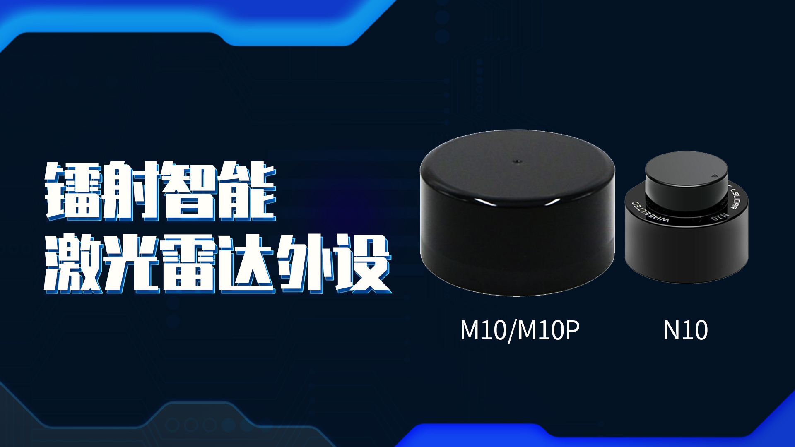
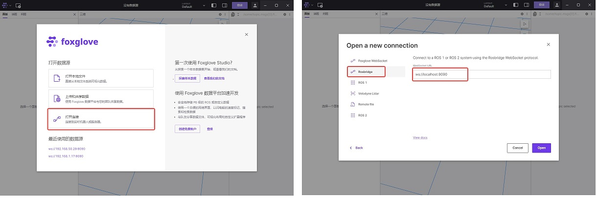
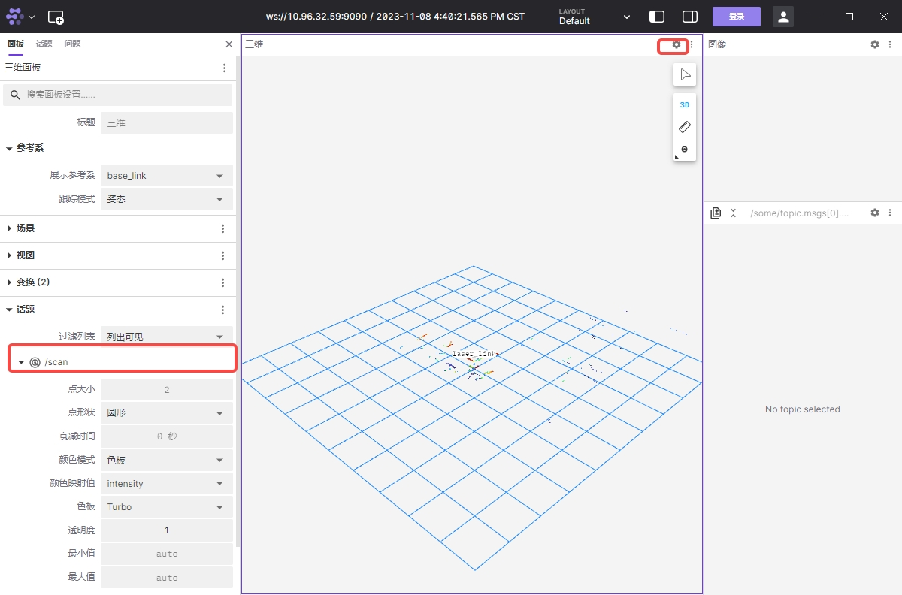

English| [简体中文](./README_cn.md)

# Function Introduction

LSLIDAR ROS2 driver sends LiDAR data in ROS2 standard message format.

# Inventory

Please refer to [LSLIDAR X3](https://www.leishen-lidar.com/tof) on the official website for the complete product model demonstration.



| Item Options     | Inventory | 
| ------------ | -------------- | 
| RDK X3  | [Purchase Link](https://developer.horizon.ai/sunrise) | 
| LSLIDAR X3 | [Purchase Link](https://www.leishen-lidar.com/tof/73) | 

# Instructions

## Preparation

1. Horizon RDK has been flashed with Ubuntu 20.04 system image provided by Horizon.

2. Connect LSLIDAR correctly to RDK X3.

## Installing LSLIDAR Driver

Connect to RDK X3 via terminal or VNC, and execute the following commands:

tros foxy: 
```bash
sudo apt update
sudo apt install -y tros-lslidar-driver
```
tros humble:
```bash
sudo apt update
sudo apt install -y tros-humble-lslidar-driver
```

**Note: If the LSLIDAR is already connected to RDK X3 during installation, it needs to be re-plugged after installation.**

## Running LSLIDAR

tros foxy:
```bash
source /opt/tros/setup.bash
ros2 launch lslidar_driver lslidar_launch.py
```
tros humble:
```bash
source /opt/tros/humble/setup.bash
ros2 launch lslidar_driver lslidar_launch.py
```

## Viewing LiDAR Data

### Method 1: Command Line 

Open a new terminal and enter the following command to view LiDAR output data:

tros foxy:
```bash
source /opt/tros/setup.bash
ros2 topic echo /scan
```
tros humble:
```bash
source /opt/tros/humble/setup.bash
ros2 topic echo /scan
```

### Method 2: Visualization using Foxglove

***Note: The device running Foxglove Studio should be on the same network segment as the RDK device***

1. Go to the [official website](https://foxglove.dev/download) of foxglove to download Foxglove Studio, and install it on your PC.

2. Open a new RDK terminal and enter the following command to install rosbridge

   tros foxy: 
   ```bash
   sudo apt update
   sudo apt install -y ros-foxy-rosbridge-suite
   ```
   tros humble:
   ```bash
   sudo apt update
   sudo apt install -y ros-humble-rosbridge-suite
   ```

3. Run the following command to start rosbridge


    tros foxy:
    ```bash
    source /opt/tros/setup.bash
    ros2 launch rosbridge_server rosbridge_websocket_launch.xml
    ```
    tros humble:
    ```bash
    source /opt/tros/humble/setup.bash
    ros2 launch rosbridge_server rosbridge_websocket_launch.xml
    ```

4. Open Foxglove Studio, select "Open Connection," choose the rosbridge connection method in the upcoming dialog, and enter the RDK's IP address instead of localhost.



5. Click the "Settings" button in the upper right corner of Foxglove Studio, in the panel that pops up on the left, configure the radar topic to be "visible." At this point, the studio will display the radar point cloud in real-time.



### Method 3: RVIZ Approach

Install ROS2 on a PC or in an environment that supports RVIZ. Taking the foxy version as an example, run 

tros foxy:
```bash
source /opt/ros/foxy/setup.bash
ros2 run rviz2 rviz2
```
tros humble:
```bash
source /opt/ros/humble/setup.bash
ros2 run rviz2 rviz2
```

Add LaserScan, and set the Reliability Policy to System Default


Set the Fixed Frame to base_link or laser_link to view the collected data from the LiDAR sensor


# Interface Description

## Topics

### Published Topics
| Topic                | Type                    | Description                                      |
|----------------------|-------------------------|--------------------------------------------------|
| `scan`               | sensor_msgs/LaserScan   | Two-dimensional laser radar scanning data                |

## Parameters
| Parameter name | Data Type | detail                                    |
| -------------- | ------- | ----------------------------------------- |
| frame_id     | string | Default value for frame name: `laser_frame` |
| group_ip     | string | Multicast network port for laser radar: `224.1.1.2`|
| add_multicast  | bool | Whether to add multicast IP. <br/>Default value: `false` |
| device_ip     | string | Source IP of the laser radar: `192.168.1.200`|
| device_ip_difop   | string | Destination IP of the laser radar: `192.168.1.102`|
| msop_port     | int | Radar source port number. <br/>Default value: `2368` |
| difop_port     | int | Radar source port number. <br/>Default value: `2369` |
| lidar_name     | string | Radar type name: `M10`,`M10_P`,`M10_PLUS`,`M10_GPS`,`N10`,`L10`,`N10_P` |
| angle_disable_min     | float | Start value for angle clipping.<br/>Default value: `0.0` |
| angle_disable_max     | float | End value for angle clipping.<br/>Default value: `0.0` |
| min_range     | float | Minimum receiving distance for radar.<br/>Default value: `0.0` |
| max_range     | float | Maximum receiving distance for radar.<br/>Default value: `200.0` |
| use_gps_ts  | bool | Whether the radar uses GPS time synchronization. <br/>Default value: `false` |
| interface_selection     | string | Interface selection: `net` for network port, `serial` for serial port. <br/>Default value: `laser_frame` |
| serial_port_     | string | Set the port number of the laser radar device.<br/>For example, serial port `/dev/ttyUSB0` |
| high_reflection  | bool | For M10_P radar, set to `false`, if unsure, please contact technical support |
| compensation  | bool | Whether the M10 series uses angle compensation function.<br/>Default value: `false` |
| pubScan  | bool | Whether to publish the scan topic.<br/>Default value: `true` |
| scan_topic     | string | Set the laser data topic name: `/scan` |
